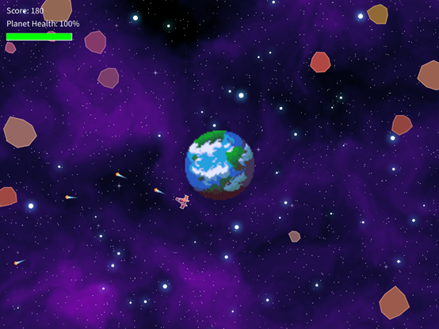

# Orbital Defender

A space-themed arcade action game built with Processing where players orbit and defend a planet from incoming meteors.

## Overview

Orbital Defender blends elements of classic arcade shooters with a unique orbital movement mechanic that creates a distinct gameplay experience. Players control a ship orbiting around a planet and must defend their home world from an onslaught of meteors by shooting them down before they can impact the surface.

## Features

- Orbital movement mechanics
- Procedurally generated meteors
- Two difficulty levels (Easy and Hard)
- Explosion animations and visual effects
- Dynamic difficulty scaling based on score
- High score tracking
- Sound effects and background music

## Game Description

### Objective

The primary objective is to protect the planet from incoming meteors for as long as possible while achieving the highest score. Players earn points by destroying meteors before they hit the planet, with larger meteors worth more points. The game ends when the planet's health reaches zero after sustaining too much damage from meteor impacts.

### Gameplay

The game begins at the main menu where players can select a difficulty level (Easy or Hard). After selecting a difficulty, the game starts with the player's ship in orbit around the planet positioned at the center of the screen.

Meteors spawn from the edges of the screen and travel toward the planet. The player must rotate around the planet to position themselves to shoot down these meteors. As the player's score increases, meteors spawn more frequently, creating an escalating challenge.

The Easy mode features slower meteors and a lower spawn rate, while Hard mode has faster meteors, more frequent spawns, and a higher probability of large meteors appearing.

When a meteor is shot, it explodes and awards points to the player. If a meteor hits the planet, it causes damage based on its size and creates an explosion at the impact point. Once the planet's health is depleted, the game ends and displays the final score, along with the high score.

## Controls

- **A/D or Left/Right Arrow Keys**: Orbit clockwise/counterclockwise around the planet
- **Mouse Movement**: Aim the ship toward the cursor
- **Left Mouse Button**: Fire projectiles
- **Space Bar**: Return to menu after Game Over

## Installation and Setup

1. **Requirements**:
   - Java Runtime Environment (JRE) 8 or higher

2. **Installation Options**:
   - **Option 1 (Recommended)**: Download the latest release from the [Releases page](https://github.com/ClaudioGSDB/Orbital-defender/releases/tag/v1.0)
   - **Option 2 (From Source)**:
     - Clone this repository: `git clone https://github.com/YourUsername/OrbitalDefender.git`
     - Open the main file (`OrbitalDefender.pde`) with Processing
     - Install the Sound library: In Processing, go to Sketch > Import Library > Add Library and search for "Sound"

3. **Running the Game**:
   - Double-click the downloaded executable (.exe for Windows, .app for Mac)
   - Or run the JAR file: `java -jar OrbitalDefender.jar`

## Assets Used

### Images
- **planet.png**: Earth-like planet sprite
- **planet-hard.png**: Alternate planet sprite for hard difficulty
- **ship.png**: Player's spaceship
- **projectile.png**: Laser projectile
- **background.png**: Space background with stars

### Sound Files
- **background_music.mp3**: Ambient space music
- **laser_shot.mp3**: Laser firing effect
- **explosion.mp3**: Meteor explosion sound
- **button_click.mp3**: UI button sound

*All images were sourced from [itch.io](https://itch.io/) under free-to-use licenses. Sound effects were downloaded from [Pixabay](https://pixabay.com/).*

## How to Play

### Starting the Game
- Launch the game and select a difficulty level from the main menu
- "Easy" is recommended for beginners, while "Hard" provides a greater challenge

### Defending the Planet
- Use A/D or arrow keys to orbit around the planet
- Position yourself to intercept incoming meteors
- Aim with your mouse and shoot with left-click
- Destroy meteors before they hit the planet
- Watch your planet's health at the top of the screen

### Scoring
- Small meteors: 10 points
- Medium meteors: 20 points
- Large meteors: 30 points
- High scores are saved between game sessions

### Game Over
- The game ends when planet health reaches 0%
- Press Space to return to the main menu
- Try to beat your high score on subsequent attempts

## Project Structure

- **OrbitalDefender.pde**: Main game file with game states and core logic
- **Player.pde**: Player ship behavior and controls
- **Meteor.pde**: Meteor generation and behavior
- **Projectile.pde**: Projectile behavior and visual effects
- **Explosion.pde**: Explosion animations

## Author

Claudio Sciotto
